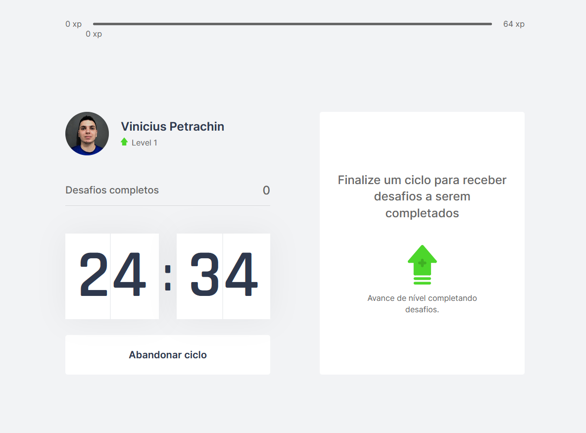
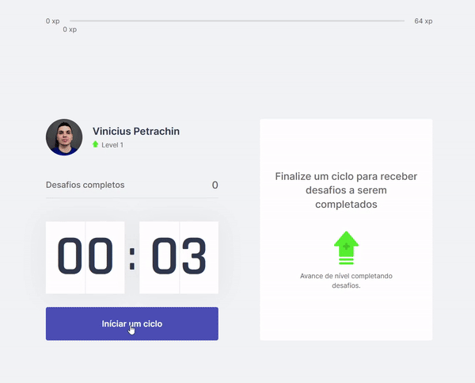

# [Move.it](https://movit-nlw.vercel.app/)
   


<p align="center">
  
</p>

<p align="center">
  
</p>


---

## About the project <a id="en_us"></a>

[Move.it](https://movit-nlw.vercel.app/) is an application that is based on the pomodoro technique, a time management method that promises greater performance and focus during your activity and work.
In the application the user gains level when completing the challenges, thus being a good incentive for him to practice the pomodoro technique.
The application was built using Next.js, a framework based on React that allows modern solutions such as SSR (Server Side Rendering) ideal for SEO.
The persistence of data in this application is made using cookies that allow the user not to lose all his data when reloading the page.

## Content
* [Technologies used](#technologies)
* [How to run the project](#installation)
* [Installation - Front-end](#installation-front)

## Technologies used <a id="technologies"></a>

- [x] React
- [x] Next
- [x] Typescript
- [x] JS cookie

## How to execute the project <a id="installation"></a>
To execute the project, you'll need to have Node and NPM or Yarn installed to setup all the dependencies.


### Installation - Front-end (Web) <a id="installation-front"></a>

In the project root folder:

```bash
npm install
npm run start
```

If you are using Yarn, use this:
```bash
yarn install
yarn start
```
If you want you can use the developer mode
``yarn dev``

After completing the installation and running ``yarn start`` or ``npm run start`` the application will run in your browser.

---
###### Developed on Next Level Week from [Rocketseat](https://rocketseat.com.br) by [Vinicius Petrachin](https://www.linkedin.com/in/petrachin/)
